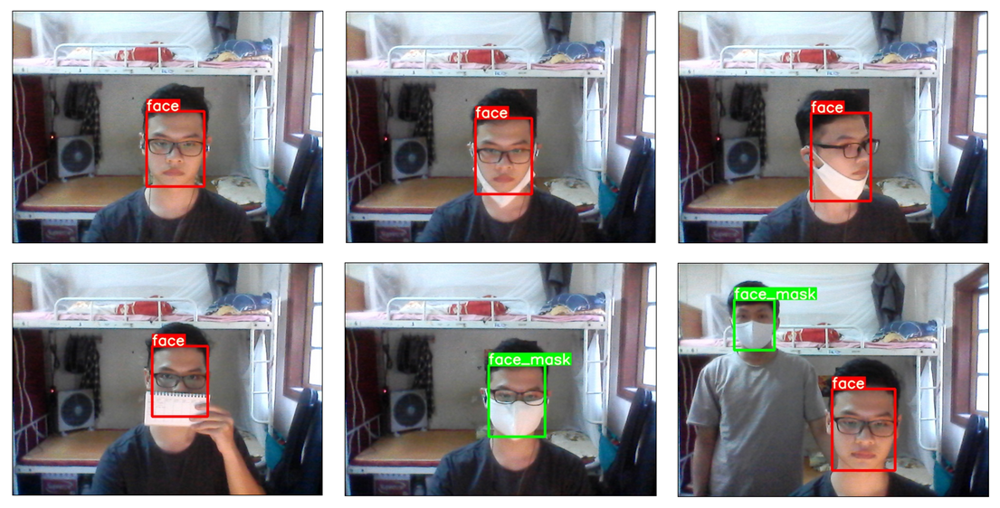
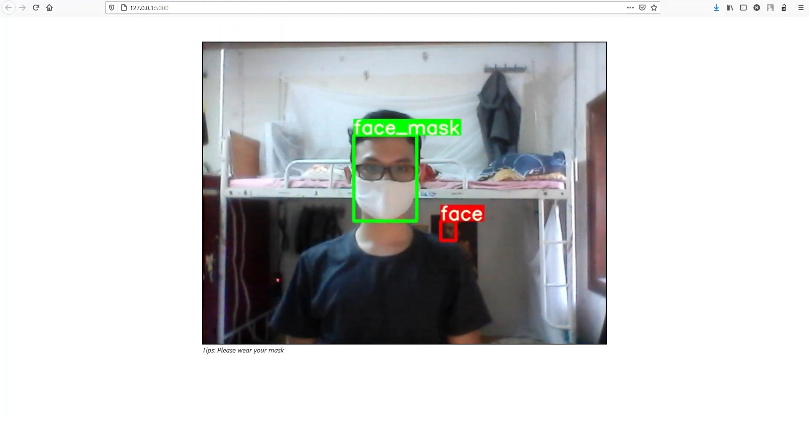

# Face mask detector

<a href="https://hub.docker.com/r/manhdung20112000/face-mask"></a>
<a href="https://wandb.ai/nmd2000/Face_Mask"></a>

# Abstract


Today is April 25, 2021, COVID-19 has affected countries all over the world. Turning back a few day ago, India has recorded approximately 2000 death case per day, which once again alert us about how dangerous this disease are.

In this project, our main purpose is to build a detection system, that able to detect a person is either wearing a mask. The system based on some latest object detection, they are:
- YOLOv3
- YOLOv3 fastest
- YOLOv5

By using the pre-defined models that were provided and supported by [ultralytics](https://github.com/ultralytics/). We will compare the result between these models, and implement a simple web application for run these model.

# [Training Result](#result)
[assets_5]: https://github.com/ultralytics/yolov5/releases
[assets_3]: https://github.com/ultralytics/yolov3/releases

Model |size<br><sup>(pixels) |mAP<sup>val<br>0.5:0.95 |mAP<sup>val<br>0.5 |mAP<sup>test<br>0.5:0.95 |mAP<sup>test<br>0.5 |Speed<br><sup>V100 (ms) | |params<br><sup>(M) 
---   |---                   |---                     |---                |---                      |---                |---                     |---|---              
[YOLOv5s][assets_5]    |640  |  65.4   |  93.1   |  65.4   |93.2     |**6.3**| |7.3   
[YOLOv5m][assets_5]    |640  |  66.5   |  93.9   |  66.7   |93.7     |7.9    | |21.4  
[YOLOv5l][assets_5]    |640  |**65.8** |**93.9** | 66.9   | 93.8     |12.1   | |47.0  
[YOLOv5x][assets_5]    |640  |  66.5   |  93.5   | **67.3**|**94.0** |  20.7  | |87.7  
| | | | | | || |
[YOLOv3 fastest][assets_3]   |640  | -       | -       | -       | -       | -       | | | - 
[YOLOv3-tiny][assets_3]      |640  |**55.7** |**87.9** |**55.6** |**87.8** |**3.4**  | |8.8  
[YOLOv3-SSP][assets_3]       |640  | -       | -       | -       | -       | -       | |63.0
[YOLOv3][assets_3]           |640  | -       | -       | -       | -       | -       | |61.9

We public our training result in [wandb](https://wandb.ai/) for if you want to dig deeper inside each model's training process, then make sure check out our project in [W&B](https://wandb.ai/nmd2000/Face_Mask).
# [Dataset](#dataset)
The dataset is composed of [WIDER Face](http://shuoyang1213.me/WIDERFACE/) and [MAFA](www.escience.cn/people/geshiming/mafa.html) by [AIZOOTech](https://github.com/AIZOOTech/FaceMaskDetection). 

In this dataset contains **7959 images** in total, have been splited the dataset into 3 part: Train, Valid and Test; and converted them into YOLO format. You can find our dataset in [Kaggle](https://www.kaggle.com/nguyenmanhdung/facemaskyolo)

Or by running Kaggle API:
```
kaggle datasets download -d nguyenmanhdung/facemaskyolo
```

# [Deployment](#deploy)
We've implemented a simple `Flask` application for demonstrate our work where located in `/deployment` folder. 

The quick demo is in the figure below, where we can see the `yolov3 tiny` model have a acceptable accuracy and a ablity of detecting multiple faces. 



However, it's noticable some error that the model's made in some common scenarios in the video demonstration at Youtube:

<a href="https://youtu.be/YdGf6xMGzVQ?t=7" title=""></a>

To run the `Flask` application, direct to the `\deployment` folder, install all the requirements and run the following command:
```
$ pip install -r requirements.txt

$ python app.py
```

The output will be like shown below, thus, access to http://127.0.0.1:5000/ (or the port you have configured) to open the application(the browser should as for Webcam permission).

```
 * Serving Flask app "app" (lazy loading)
 * Environment: production
   WARNING: This is a development server. Do not use it in a production deployment.
   Use a production WSGI server instead.
 * Debug mode: on
 * Running on http://127.0.0.1:5000/ (Press CTRL+C to quit)
 * Restarting with stat
 * Debugger is active!
 * Debugger PIN: 219-729-123
```
You might notice that we also support an builed application through `Dockerfile`, which you can find at <a href="https://hub.docker.com/r/manhdung20112000/face-mask"></a>

*Note:* We still in process of developing this deployment, if you have anytrouble, feel free to contact us.

# [Team member](#team)
**Dung Manh Nguyen (me)**
- Github: [manhdung20112000](https://github.com/manhdung20112000)
- Email: [manhdung20112000@gmail.com](manhdung20112000@gmail.com)

**Hai Phuc Nguyen**
- Github: [HaiNguyen2903](https://github.com/HaiNguyen2903)

**Hoang Huy Nguyen**
- Github: [hhoanguet](https://github.com/hhoanguet)
